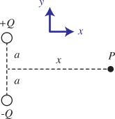
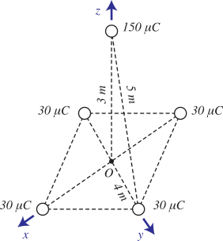
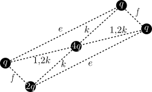
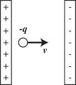

# UFSM00247 (Eletromagnetismo)

**Docente:** [Prof. Dr. Luiz Fernando Freitas-Gutierres](https://www.linkedin.com/in/lffreitas-gutierres/) ([luiz.gutierres@ufsm.br](mailto:luiz.gutierres@ufsm.br)). 

## Lista de exercícios 01

**Leia com atenção as instruções abaixo.**

1. Sendo $A$ uma constante, o campo elétrico em um domínio de validade hipotético é definido pelas componentes $E_x = x^2$, $E_y = Az$ e $E_z = Ay$ em coordenadas cartesianas. Qual é a força elétrica exercida sobre uma carga de 2 C localizada no ponto $T\left(2,1,3\right)$.

2. [*Julgue como certo ou errado*] Em termos de $Q$, $x$, $a$ e $k$, a intensidade do campo elétrico no ponto $P$ da Figura 1 é dada por $\left(2kQa)\right / \left(x^2 + a^2\right)^{3/2}$. A direção do campo elétrico em P é ao longo de $+\hat{y}$.

3. Quatro cargas elétricas de 30 $\mu$ C estão localizadas nos vértices de um quadrado cuja diagonal mede 8 m. Determine a força elétrica sobre uma carga de 150 $\mu$ C posicionada a 3 m acima do ponto central do quadrado.

4. Duas cargas elétricas positivas, $+Q$ e $+4Q$, estão separadas por uma distância $d$ no espaço livre. Uma terceira carga é inserida nesse domínio, entre as duas cargas iniciais, de modo que o sistema se mantenha em equilíbrio. Determine a localização, a magnitude e o sinal da terceira carga elétrica. Para simplificação, considere o problema como unidimensional.

5. [*Julgue como certo ou errado*] Com base no arranjo eletrostático ilustrado na Figura 3, analise as afirmações a seguir:

    - A energia potencial do arranjo eletrostático é maior que $20/\left(4 \pi \epsilon_o\right)$, considerando que $q = + 1$ C, $k = 1$ m, $e = 2{,}6$ m e $f = 1/2$ m.

    - A magnitude da força elétrica exercida sobre a carga $4q$ é equivalente a $8q^2 / \left(4 \pi \epsilon_o k^2 \right)$ N.

6. [*Julgue como certo ou errado*] Se a diferença de potencial elétrico é negativa, há um ganho de energia potencial durante o movimento, ou seja, um agente externo é responsável por realizar trabalho.

7. Para o sistema eletromagnético representado na Figura 4 é possível afirmar que (**atenção, mais de uma resposta pode estar correta**):

    - O campo elétrico realiza trabalho positivo.
    - O agente externo realiza trabalho positivo.
    - O campo elétrico realiza trabalho negativo.
    - O agente externo realiza trabalho negativo.
    - A carga se move para o maior potencial elétrico.
    - A carga se move para o menor potencial elétrico.
    - Com o movimento, a tendência é de aumentar a energia potencial eletrostática do sistema.
    - Com o movimento, a tendência é de diminuir a energia potencial eletrostática do sistema.

