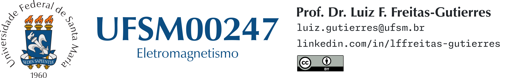

# UFSM00247 (Eletromagnetismo)

**Docente:** [Prof. Dr. Luiz Fernando Freitas-Gutierres](https://www.linkedin.com/in/lffreitas-gutierres/) ([luiz.gutierres@ufsm.br](mailto:luiz.gutierres@ufsm.br)). 

## Lista de exercícios 01

Os exercícios sugeridos estão contidos em E-Books disponibilizados *online* aos discentes por meio do [Minha Biblioteca](https://portal.ufsm.br/biblioteca/leitor/minhaBiblioteca.html), acessível no Portal Biblioteca da Universidade Federal de Santa Maria (UFSM).

- Hayt Jr., W. H., & Buck, J. A. (2013). *Eletromagnetismo* (8th ed.). AMGH. [https://integrada.minhabiblioteca.com.br/books/9788580551549](https://integrada.minhabiblioteca.com.br/books/9788580551549)
    - Exemplo 2.1 (p. 28, p-PDF. 43).
    - Exercício prático 2.1 (p. 29, p-PDF. 44).
    - Exemplo 2.2 (p. 32, p-PDF. 47).
    - Exercício prático 2.2 (p. 32, p-PDF. 47).
    - Exemplo 2.3 (p. 34, p-PDF. 49).
    - Exercício prático 2.4 (p. 35, p-PDF. 50).
    - Exercício prático 2.5 (p. 39, p-PDF. 54).
    - Exercício prático 2.6 (p. 41, p-PDF. 56).
    - Problema 2.1 (p. 44, p-PDF. 59).
    - Problema 2.2 (p. 44, p-PDF. 59).
    - Problema 2.3 (p. 44, p-PDF. 59).
    - Problema 2.4 (p. 44, p-PDF. 59).
    - Problema 2.5 (p. 44, p-PDF. 59).
    - Problema 2.6 (p. 45, p-PDF. 60).
    - Problema 2.7 (p. 45, p-PDF. 60).
    - Problema 2.10 (p. 45, p-PDF. 60).
    - Problema 2.13 (p. 45, p-PDF. 60).
    - Problema 2.17 (p. 46, p-PDF. 61).
    - Problema 2.19 (p. 46, p-PDF. 61).

