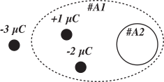
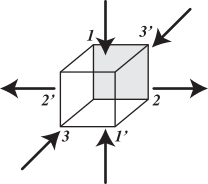

# UFSM00247 (Eletromagnetismo)

**Docente:** [Prof. Dr. Luiz Fernando Freitas-Gutierres](https://www.linkedin.com/in/lffreitas-gutierres/) ([luiz.gutierres@ufsm.br](mailto:luiz.gutierres@ufsm.br)). 

## Lista de exercícios 03

**Leia com atenção as instruções abaixo.**

1. [*Julgue como certo ou errado*] Um conjunto de cinco cargas elétricas pontuais é englobado por uma surperfície arbitrária $S$: $q_1 = +3$ nC, $q_2 = -2$ nC, $q_3 = +2$ nC, $q_4 = +4$ nC e $q_5 = -1$ nC. É correto afirmar que o fluxo elétrico através de $S$ é equivalente a 6 nNm²/C².

2. [*Julgue como certo ou errado*] Se uma carga $q$ estiver localizada no centro de um cabo de lado $T$, o fluxo do campo elétrico $\vec{E}$ através de uma das superfícies do cubo é igual a $q/\left( 4 \epsilon_o \right)$.

3. [*Julgue como certo ou errado*] A magnitude do campo elétrico nas proximidades de qualquer superfície condutora carregada, independentemente do formato, é igual a $\sigma/\epsilon_o$, onde $\sigma$ é a densidade superficial de carga elétrica. Isso é válido para o limite externo à superfície do condutor (ou seja, em uma região muito próxima da superfície).

4. [*Julgue como certo ou errado*] Na Figura 1, o fluxo elétrico observado em #A1 e #A2 é equivalente a $-4\mu/\epsilon_o$.

5. [*Julgue como certo ou errado*] Mede-se o campo elétrico originado de uma superfície gaussiana cilíndrica de raio 5 cm e altura 15 cm. Em todos os pontos da parte curva da superfície do cilindro, verifica-se um campo elétrico constante com magnitude igual a 550 N/C, apontando radialmente para fora do cilindro. Assumindo isso, a quantidade de carga envolvida pela superfície é igual a 2,29e-10 C.

6. Pode-se afirmar que o cubo ilustrado na Figura 2, com indicação das linhas do campo elétrico $\vec{E}$ por superfície, abriga em seu interior:

    - Uma carga elétrica positiva.
    - Uma carga elétrica negativa.
    - Nenhuma carga elétrica.
    - Uma carga elétrica líquida (resultante) positiva.
    - Uma carga elétrica líquida (resultante) negativa.
    - Nenhuma carga elétrica líquida (resultante).

