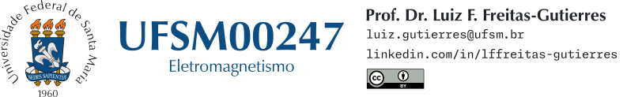

# UFSM00247

**UFSM00247** é a disciplina intitulada [Eletromagnetismo](https://www.ufsm.br/ementario/disciplinas/UFSM00247), ofertada no Curso de Graduação em Engenharia de Telecomunicações da [Universidade Federal de Santa Maria](https://www.ufsm.br/). Este repositório reúne listas de exercícios, roteiros para simulações computacionais, tarefas e materiais complementares.

**Docente:** [Prof. Dr. Luiz Fernando Freitas-Gutierres](https://www.linkedin.com/in/lffreitas-gutierres/) ([luiz.gutierres@ufsm.br](mailto:luiz.gutierres@ufsm.br)). 