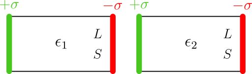

# UFSM00247 (Eletromagnetismo)

**Docente:** [Prof. Dr. Luiz Fernando Freitas-Gutierres](https://www.linkedin.com/in/lffreitas-gutierres/) ([luiz.gutierres@ufsm.br](mailto:luiz.gutierres@ufsm.br)).

## Tarefa 02

**Leia com atenção as instruções abaixo.**

Em relação aos campos elétrico ($\vec{E}$) e de deslocamento elétrico ($\vec{D}$), faça a distinção entre eles a partir das instruções a seguir:

1. Considere dois blocos de materiais dielétricos distintos (1 e 2), um com permissividade relativa $\epsilon_{r1}$ e o outro com $\epsilon_{r2}$, onde $\epsilon_{r1} < \epsilon_{r2}$. Os dois blocos apresentam características construtivas semelhantes, como comprimento $L$ e área da seção transversal $S$. Ambos possuem distribuições de cargas superficiais $\sigma$ que geram campos elétricos em suas estruturas, conforme ilustrado na figura a seguir.
2. Com base nessas especificações, realize a comparação utilizando formulações matemáticas apropriadas:
    - Induções elétricas $D_1$ e $D_2$.
    - Campos elétricos $E_1$ e $E_2$.
    - Fluxos elétricos $\phi_{E1}$ e $\phi_{E2}$.
    - Fluxos de deslocamento elétrico $\phi_{D1}$ e $\phi_{D2}$.

**Observações:**

- Utilize, obrigatoriamente, o campo de resposta disponível no Moodle, no qual é possível inserir também figuras e equações.
